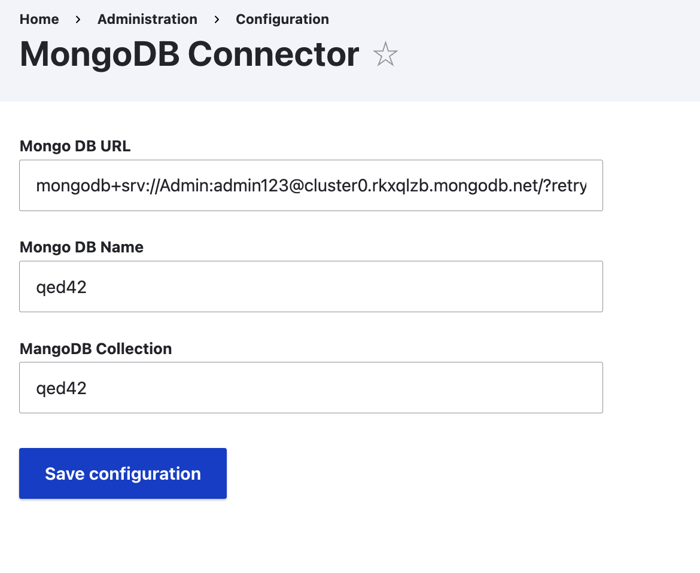
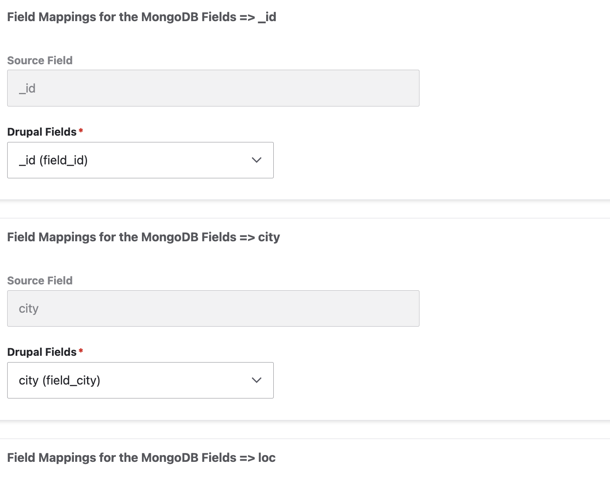

## INTRODUCTION

The MongoDB Migrator module is a Create a migration from Source Mongodb to Custom entity.

The primary use case for this module is:

- Migration of the data from source mongodb to drupal custom entity.
- Field mapping interface to assign which field that the data needs to be import.

## REQUIREMENTS

DESCRIBE_MODULE_DEPENDENCIES_HERE
 - qed42_assignment
 - mongodb setup with the data.

## INSTALLATION

Install the mongodb migrator module, it will create the configuration form to connect the mongo db.
It will create seperate config for field mapping.

## CONFIGURATION
- Go to /admin/config/mongodb-connection -> It will ask for mongodb url, db name, collection
- 
- Go to /admin/config/qed42-assignment -> Field which are disabled will be the mongodb field present in the database.
  Field below in the select list will be the mapping of drupal field.

- After Configuring mapping, run the migration script
  ``` ddev drush mim mongodb_to_custom_entity ```bash


